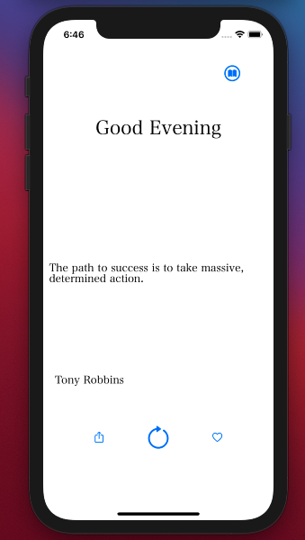

# goodthoughts-app-ios

Utilized:
1. Simple Implementation of Core Data
2. URLSessions instead of using a bloated api for network calls.
3. Programmatic UIKit (Before moving on to SwiftUI)

API Used for the quotes: https://type.fit/api/quotes

